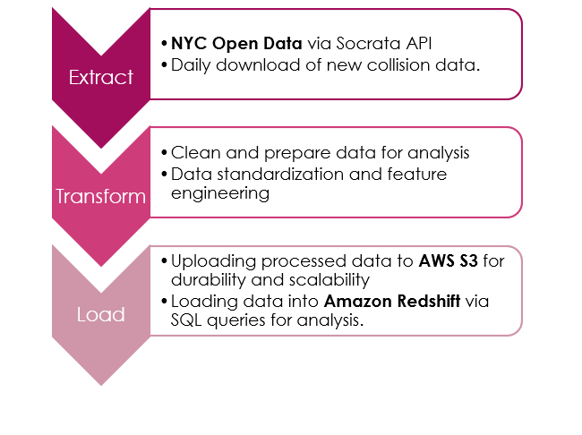
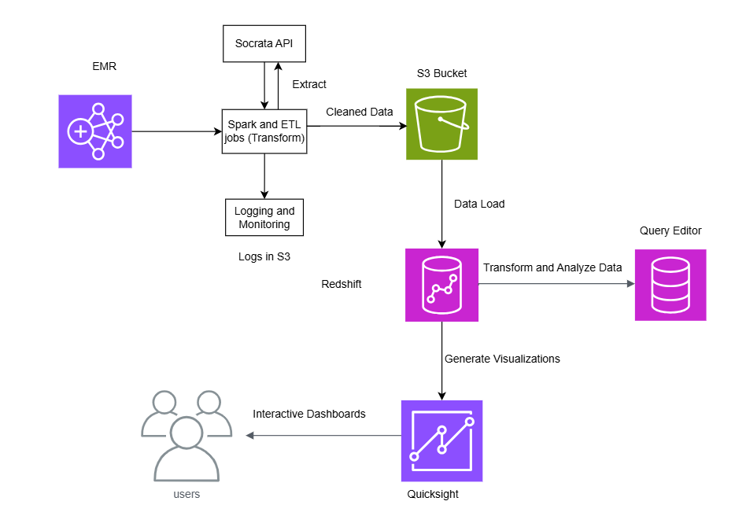

# NYC Collision ETL Project

## Project Description
This project implements an ETL pipeline to process NYC collision data using Python, AWS, and Spark. The pipeline extracts data from the Socrata API, transforms it for analysis, and loads it into Amazon Redshift.

## AWS Setup
### Creating an EMR Cluster
1. Go to the AWS Management Console and navigate to the EMR service.
2. Click on "Create Cluster" and configure the following:
   - Cluster Name: `NYC-Collision-ETL`
   - Applications: Ensure Spark is selected.
   - Instance Type: Select appropriate instance types for master and core nodes.
   - Security Groups: Use or create groups with necessary access permissions.
3. Launch the cluster and note the master node URL for accessing Spark.

### Creating a Redshift Cluster
1. Go to the AWS Management Console and navigate to the Redshift service.
2. Click on "Create Cluster" and configure the following:
   - Cluster Name: `NYC-Collision-Data`
   - Node Type: Choose an appropriate node type.
   - Database Name: `dev`
   - Master User and Password: Set credentials for connecting to the cluster.
3. Launch the cluster and note the endpoint to use in `config.py`.
4. Ensure the Redshift cluster is in the same VPC as other AWS resources for seamless connectivity.

### IAM Roles and Permissions
- Update IAM roles for all services (S3, EMR, Redshift, etc.) with necessary policies:
  - S3 Access: Ensure read and write access to the required buckets.
  - Redshift: Attach `AmazonRedshiftFullAccess` and `AmazonS3ReadOnlyAccess` policies.
  - EMR: Attach `AmazonEMRFullAccessPolicy` and permissions to interact with S3 and Redshift.

## Redshift Table Schema
The following schema is required for the Redshift table:
```sql
CREATE TABLE public.collisions (
    collision_id INT,
    crash_timestamp TIMESTAMP,
    crash_date DATE,
    crash_time VARCHAR(10),
    year INT,
    month INT,
    day_of_week INT,
    is_weekend BOOLEAN,
    time_of_day VARCHAR(20),
    borough VARCHAR(50),
    zip_code VARCHAR(10),
    latitude DOUBLE PRECISION,
    longitude DOUBLE PRECISION,
    location VARCHAR(MAX),
    on_street_name VARCHAR(255),
    cross_street_name VARCHAR(255),
    off_street_name VARCHAR(255),
    total_injuries INT,
    total_fatalities INT,
    severity_category VARCHAR(50),
    number_of_persons_injured INT,
    number_of_persons_killed INT,
    number_of_pedestrians_injured INT,
    number_of_pedestrians_killed INT,
    number_of_cyclist_injured INT,
    number_of_cyclist_killed INT,
    number_of_motorist_injured INT,
    number_of_motorist_killed INT,
    contributing_factor_vehicle_1 VARCHAR(255),
    contributing_factor_vehicle_2 VARCHAR(255),
    contributing_factor_vehicle_3 VARCHAR(255),
    contributing_factor_vehicle_4 VARCHAR(255),
    contributing_factor_vehicle_5 VARCHAR(255),
    vehicle_type_code1 VARCHAR(255),
    vehicle_type_code2 VARCHAR(255),
    vehicle_type_code_3 VARCHAR(255),
    vehicle_type_code_4 VARCHAR(255),
    vehicle_type_code_5 VARCHAR(255)
);
```

## Dependencies
Install the required dependencies in EMR master using:
```bash
pip install -r requirements.txt
```

## Running the Project
1. Update the configuration values in `config.py`.
2. Ensure the required S3 buckets are created:
   - `nyc-collisions-ecc`
     - `config/last_collision_date.json` (Eg Format: `{ "last_collision_date": "2024-10-08" }`)
     - `raw_data`
     - `processed_data`
     - `logs/`
3. The ETL script is scheduled to run daily using `crontab`. The `crontab` entry for scheduling:
    ```
    0 0 * * * spark-submit etl_job.py
    ```

## Architecture
### ETL Flow


### AWS Workflow


## Visualization with Quicksight
Ensure Amazon Quicksight can access the Redshift table:
1. Connect Quicksight to the Redshift cluster.
2. Create a new data source in Quicksight using the `public.collisions` table.
3. Verify that the required data is accessible for creating dashboards.

## Reproducibility
1. Ensure all dependencies are installed.
2. Run the project as described above. The pipeline handles data extraction, transformation, and loading automatically.
3. Use provided scripts and configurations for end-to-end reproduction.
""")